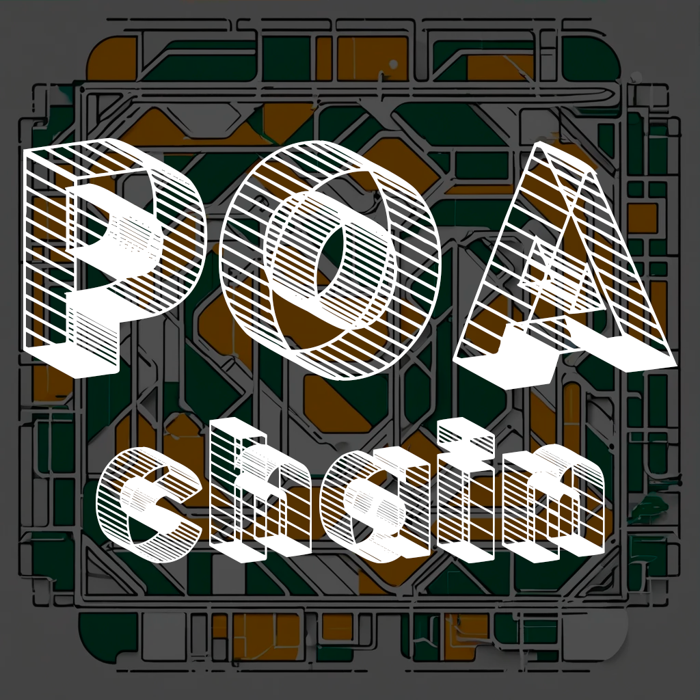

# PoaChain

A POA-based blockchain featuring new methods for node synchronization, block propagation, and automated forking.

### Key Features of the PoaChain:

**Proof of Authority (PoA) Consensus Mechanism**. PoaChain utilizes a Proof of Authority (PoA) consensus mechanism, where a small set of trusted validators are
   responsible for block validation. This significantly reduces the computational resources required, leading to faster
   transaction processing and lower costs, particularly suited for high-efficiency applications.

**New Node Synchronization Mechanism**.
   A novel node synchronization mechanism ensures that all nodes in the network remain in sync during block generation.
   Nodes operate in “ready” and “waiting” states, allowing for sequential block generation without desynchronization
   issues.

**Auto-Forking for Handling Invalid Blocks**.
   Introduces an auto-forking mechanism that automatically rejects invalid blocks, causing the chain to fork. This
   enables users to choose trusted chains and nodes, ensuring integrity and flexibility in the network. Users can view
   and manage forks via the web interface.

**Unique Transactions Without Extra Data**.
   Instead of relying on nonces, this system uses precise timestamps (down to microseconds or picoseconds) to ensure
   unique transaction hashes. This method eliminates the need for extra data, making the blockchain more efficient in
   terms of storage and data handling.

**Elliptic Curve Cryptography (ed25519)**.
   Implements elliptic curve cryptography (ed25519) for secure key generation. Addresses are created using the Bech32
   format, and wallet mnemonic phrases are generated based on the BIP39 standard, ensuring robust cryptographic
   security.

**User-Friendly Node Selection Interface**.
   The web interface allows for easy node selection, enabling users to monitor node status, block generation, and
   seamlessly switch between nodes. This provides enhanced flexibility and transparency for managing interactions with
   the blockchain.

**Detailed Block and Transaction Viewer**.
   Includes a comprehensive block and transaction viewer that allows users to explore the blockchain in detail. Each
   transaction is fully transparent, with clickable block numbers for easy navigation, providing an intuitive way to
   track and verify blockchain activity.